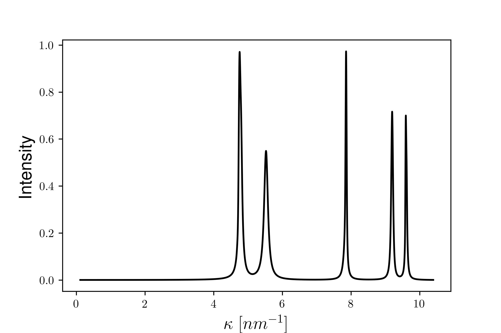

# DifFault

## Simulation of diffraction patterns of faulted crystals

This package performs the simulation of X-ray diffraction (XRD) patterns based on microstructural parameters and physical principles. These account for the effects of crystallite size, dislocations, and planar faults. 

The supported crystal structures are Body centered cubic (BCC), Face centered cubic (FCC), and Simple cubic (SC). After specifying the desired crystal structure to be modeled, given the microstructural parameters, Diffault computes the Fourier amplitudes of the profiles associated to crystallite size, dislocations and planar faults.  

The library is compatible with both Numpy and PyTorch backends for the numerical operations. 

For more information, we refer to the manuscript [1], submitted to SoftwareX. 

## Installation

1. Clone the repository with the command

```
git clone https://github.com/balintkaszas/diffault.git
```

2. Install the dependencies with pip

``` 
cd Diffault
pip install -r requirements.txt
```    
3. Install the package with 

```
pip install -e . 
```
    
## Basic usage 
After installation, the XRD patterns for an FCC crystal can be simulated by initializing a ```Peak``` object and specifying the microstructural parameters [2] for the function ```generate_multiple_peaks```. 

```
import diffaultpy as dp
kappa_max = 14
N_fourier = 8192
lattice_constant = 0.36
burgers_vector = 0.255
Ch00 = 0.36
rho = 0.01
m = 20
Rstar = 5
sigma = 0.1
q = 3
B = 0.05
intensities = np.random.rand(5, 1)
single_peak = dp.Peak(kappa_max, N_fourier, Ch00, burgers_vector, lattice_constant
spectrum = dp.generate_multiple_peaks(single_peak, m, sigma, rho, Rstar, q, peak_intensities = intensities, planar_fault_probability = B)
```



The ```examples/``` folder contains further examples and demonstrations of the usage of the library. These include 

- Discussion of the individual profiles, i.e., associated to size effects, planar faults, and dislocations. 
- Generating multiple XRD patterns simulateously with Numpy and PyTorch
- A basic example of X-ray Line Profile Analysis (XLPA) [2]. We use a simple regression routine implemented in SciPy to determine the microstructural parameters of an observed spectrum. 


## References

[1] B. Kaszás, P. Nagy, J. Gubicza, DifFault: simulation of diffraction patterns of faulted crystals, _submitted to SoftwareX_, 2024. 

[2] J. Gubicza, X-ray line profile analysis in materials science, IGI global,
2014.
